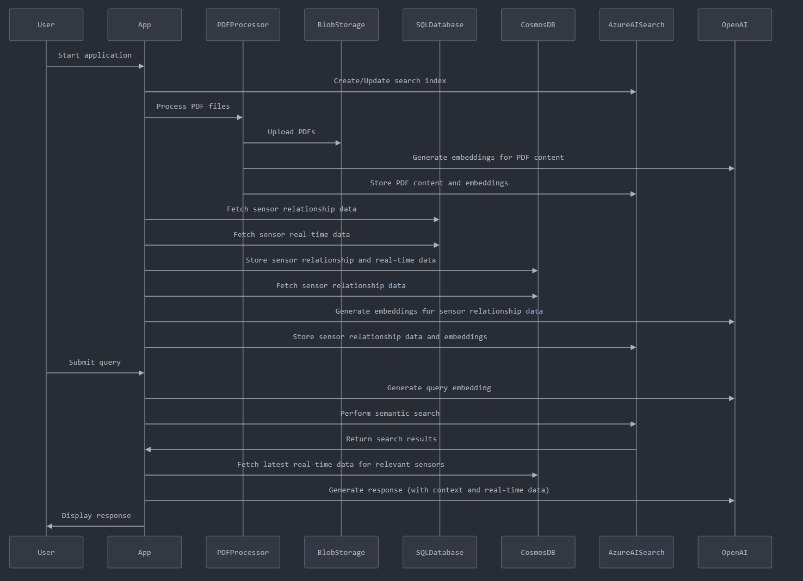

# RAG Application with Factory Manuals and Sensor Data

This application implements a Retrieval-Augmented Generation (RAG) system using factory operating manuals (PDFs) and sensor data. It offers two deployment options for embeddings and language models:

1. Azure AI Search with OpenAI API
2. Azure AI Search with Azure OpenAI Service

Both options use vector embeddings for semantic search and can generate responses using a language model. The application now loads sensor data from SQL into Cosmos DB for improved scalability and global distribution.

## Prerequisites

- Python 3.8+
- Azure AI Search service
- Azure Blob Storage account
- Azure Cosmos DB account
- MS SQL Server with sensor data
- An ODBC driver for SQL Server
- OpenAI API key (for option 1) or Azure OpenAI Service (for option 2)

## Installation

1. Clone the repository:
   ```
   git clone https://github.com/yourusername/rag-application.git
   cd rag-application
   ```

2. Create a virtual environment and activate it:
   ```
   python -m venv venv
   source venv/bin/activate  # On Windows, use `venv\Scripts\activate`
   ```

3. Install the required packages:
   ```
   pip install -r requirements.txt
   ```

4. Create a `.env` file in the project root with the following content:
   ```
   BLOB_CONNECTION_STRING=your_blob_storage_connection_string
   SQL_SERVER=your_sql_server_address
   SQL_DATABASE=your_database_name
   SQL_USERNAME=your_sql_username
   SQL_PASSWORD=your_sql_password
   SEARCH_ENDPOINT=your_azure_ai_search_endpoint
   SEARCH_KEY=your_azure_ai_search_admin_key
   COSMOS_ENDPOINT=your_cosmos_db_endpoint
   COSMOS_KEY=your_cosmos_db_key
   
   # For OpenAI API (option 1)
   OPENAI_API_KEY=your_openai_api_key
   USE_AZURE_OPENAI=False

   # For Azure OpenAI Service (option 2)
   AZURE_OPENAI_ENDPOINT=your_azure_openai_endpoint
   AZURE_OPENAI_KEY=your_azure_openai_key
   AZURE_OPENAI_DEPLOYMENT_NAME=your_azure_openai_deployment_name
   USE_AZURE_OPENAI=True
   ```

## Configuration

1. Update the `SEARCH_INDEX_NAME`, `BLOB_CONTAINER_NAME`, `EMBEDDING_MODEL`, `COSMOS_DATABASE_NAME`, and `COSMOS_CONTAINER_NAME` variables in the script if needed.

2. Adjust the SQL query in the `get_sql_data()` function to match your sensor data table structure.

3. Set the `pdf_directory` variable in the `main()` function to the path where your PDF manuals are stored.

4. Choose between OpenAI API and Azure OpenAI Service by setting the `USE_AZURE_OPENAI` environment variable in the `.env` file.

## Usage

Run the application:

```
python rag_application.py
```

This will:
1. Create or update the Azure AI Search index.
2. Process all PDF files in the specified directory.
3. Upload PDFs to Azure Blob Storage.
4. Generate embeddings for the PDF content and store them in Azure AI Search.
5. Load sensor data from SQL into Cosmos DB.
6. Process sensor data from Cosmos DB, generate embeddings, and store them in Azure AI Search.
7. Perform an example semantic search query and generate a response using the chosen language model.

## Data Flow

1. PDF manuals are processed and stored in Azure Blob Storage.
2. Sensor data is loaded from SQL into Cosmos DB for improved scalability and global distribution.
3. Both PDF content and sensor data are embedded and indexed in Azure AI Search.
4. Semantic search queries use Azure AI Search for retrieval.
5. Retrieved context is used with OpenAI or Azure OpenAI to generate responses.

## Application Flow

Below is a sequence diagram illustrating the main flow of the RAG application:



This diagram shows the interactions between various components of the system, including the user, application, PDF processor, Azure services (Blob Storage, Cosmos DB, AI Search), SQL Database, and OpenAI.

## Deployment

To deploy this application in a production environment:

1. Set up a virtual machine or container in your preferred cloud provider (e.g., Azure VM, Azure Container Instances).

2. Install Python and the required dependencies on the deployment machine.

3. Copy the application code, `requirements.txt`, and `.env` file to the deployment machine.

4. Set up a scheduled task or cron job to run the script periodically, depending on how often you want to update the data.

5. Consider using Azure Key Vault for storing sensitive information instead of the `.env` file in a production environment.

6. Implement logging and monitoring to track the application's performance and any potential issues.

## Semantic Search and Response Generation

The application includes `semantic_search` and `generate_response` functions that demonstrate how to perform vector similarity search using Azure AI Search and generate responses using either OpenAI API or Azure OpenAI Service. You can modify these functions or create additional ones based on your specific requirements.

## Choosing Between OpenAI API and Azure OpenAI Service

1. OpenAI API:
   - Easier to set up and use
   - Always uses the latest model versions
   - Billing is handled through OpenAI

2. Azure OpenAI Service:
   - Provides Azure-specific features like role-based access control (RBAC) and private networking
   - Allows for more customization and fine-tuning of models
   - Billing is handled through Azure
   - Provides additional compliance and data residency options

Choose the option that best fits your organization's needs and compliance requirements.

## Next Steps

- Implement a more comprehensive query interface or API to expose the search and generation functionality.
- Add error handling and retries for better resilience.
- Optimize the embedding and indexing process for large-scale data by implementing batch processing.
- Implement a web interface for easier interaction with the RAG system.
- Fine-tune the language model on your specific domain data for improved response generation (if using Azure OpenAI Service).
- Implement a change feed processor for Cosmos DB to automatically update Azure AI Search when new sensor data is added.

## Support

For any questions or issues, please open an issue in the GitHub repository or contact the development team.
